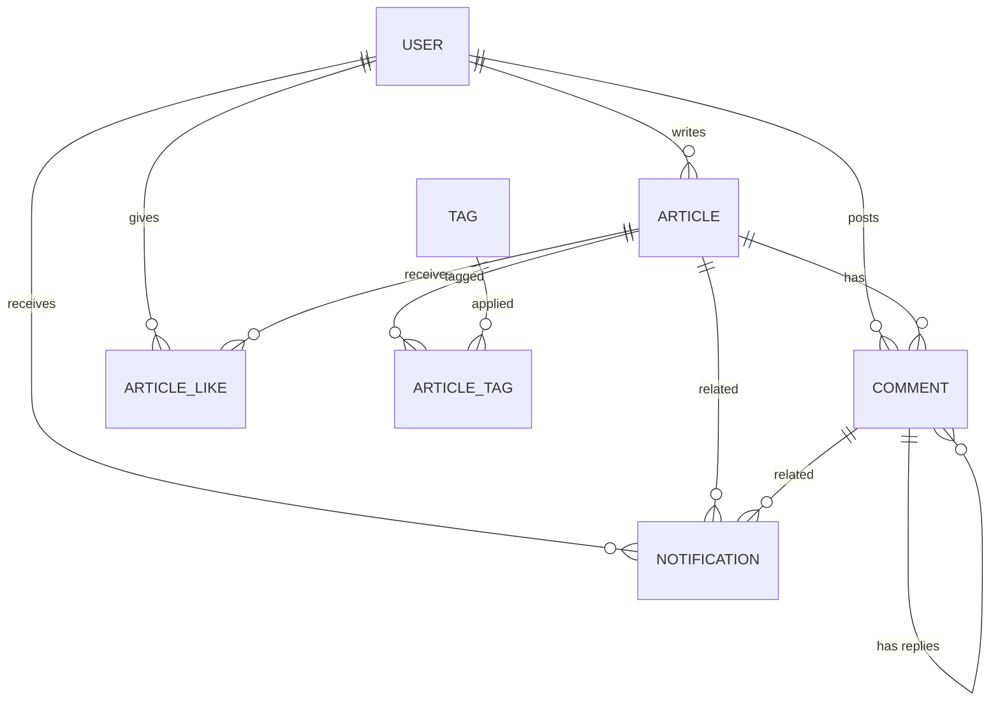

# 设计文档 — 博客系统第二期功能扩展

## 概述

本文档描述博客系统第二期扩展功能的技术设计方案。在一期已有系统（用户注册登录、文章 CRUD、评论、点赞、音乐播放器）基础上，新增七大功能模块：文章标签/分类系统、文章搜索、用户个人主页、Markdown 编辑器、图片上传、角色权限体系和评论/点赞通知。

技术栈完全沿用一期，确保架构兼容：
- 前端：Nuxt 3（Vue 3 SSR）+ JavaScript，Playfair Display + Source Han Sans SC 字体，暖色调旅行博客风格
- 后端：Spring Boot 2.7.18 + Java 8（javax.* 包），使用 WebSecurityConfigurerAdapter
- 数据库：MySQL 8，JPA 自动建表（ddl-auto=update）
- 认证：JWT（jjwt 0.9.1），BCrypt 密码加密
- 测试：后端 JUnit 5 + Mockito + jqwik，前端 Vitest + Vue Test Utils + fast-check

### 设计边界

- 本系统仍为单体应用，不涉及微服务拆分
- 文章搜索使用 MySQL LIKE 模糊匹配，不引入 Elasticsearch 等搜索引擎
- 图片上传存储到服务器本地文件系统，不使用 OSS/S3 等云存储
- Markdown 编辑器使用 md-editor-v3 组件库，不自行实现编辑器
- 通知使用前端轮询（30 秒间隔），不引入 WebSocket 或 SSE
- 角色仅区分 ROLE_USER 和 ROLE_ADMIN 两种，不实现更细粒度的 RBAC 权限模型
- 不引入缓存层（Redis）、消息队列等中间件
- 所有新增功能必须兼容一期的 API 响应格式（`ApiResponse<T>`）、异常处理机制和前端设计风格
- 前端新增页面遵循一期的 SSR/CSR 渲染策略：内容页 SSR，交互页 CSR
- 后端继续使用 `WebSecurityConfigurerAdapter`（Spring Boot 2.7.x），不迁移到新版 SecurityFilterChain 配置方式

## 架构

### 整体架构（沿用一期，新增模块标注 ★）

```
┌──────────────────┐                    ┌──────────────────────┐     JDBC     ┌─────────┐
│   Browser/Client │                    │   Spring Boot API     │ ◄──────────► │  MySQL  │
│                  │                    │     (Backend)         │              │   8.x   │
└────────┬─────────┘                    │                      │              └─────────┘
         │                              │  ★ FileService       │
         │  HTML (SSR) / JSON (CSR)     │  ★ TagService        │     File I/O  ┌─────────┐
         │                              │  ★ NotificationSvc   │ ◄────────────► │ uploads/│
┌────────▼─────────┐                    │  ★ SearchModule      │               └─────────┘
│   Nuxt 3 Server  │ ──────────────────►│  ★ ProfileService    │
│  (SSR + API Proxy)│                   └──────────────────────┘
└──────────────────┘
```

### 后端分层（沿用一期模式）

```
Controller → Service → Repository → MySQL
     ↑
  JWT Filter (Spring Security + ★ @PreAuthorize 权限控制)
```

新增模块遵循一期的 Controller → Service(Interface) → ServiceImpl → Repository 分层模式。

### 前端结构扩展

```
├── pages/
│   ├── index.vue              # 首页（★ 新增标签筛选、搜索入口）
│   ├── articles/
│   │   ├── [id].vue           # 文章详情页（★ 新增 Markdown 渲染、标签展示）
│   │   ├── create.vue         # ★ 文章创建页（Markdown 编辑器）
│   │   └── edit/[id].vue      # ★ 文章编辑页（Markdown 编辑器）
│   ├── search.vue             # ★ 搜索结果页（SSR）
│   ├── tags/[id].vue          # ★ 标签文章列表页（SSR）
│   ├── users/[id].vue         # ★ 用户个人主页（SSR）
│   ├── login.vue
│   └── register.vue
├── components/
│   ├── MusicPlayer.vue
│   ├── CommentList.vue
│   ├── CommentForm.vue
│   ├── ★ MarkdownEditor.vue   # Markdown 编辑器封装组件
│   ├── ★ MarkdownRenderer.vue # Markdown 渲染组件
│   ├── ★ TagSelector.vue      # 标签选择组件
│   ├── ★ TagBar.vue           # 标签筛选栏组件
│   ├── ★ SearchBar.vue        # 搜索输入框组件
│   ├── ★ NotificationBell.vue # 通知铃铛组件
│   ├── ★ NotificationList.vue # 通知下拉列表组件
│   ├── ★ ImageUploader.vue    # 图片上传组件
│   └── ★ UserAvatar.vue       # 用户头像组件
├── composables/
│   ├── useAuth.js
│   ├── useArticle.js          # ★ 扩展：支持标签参数
│   ├── useComment.js
│   ├── useLike.js
│   ├── useMusic.js
│   ├── ★ useTag.js            # 标签 API 调用
│   ├── ★ useSearch.js         # 搜索 API 调用
│   ├── ★ useProfile.js        # 用户主页 API 调用
│   ├── ★ useUpload.js         # 图片上传 API 调用
│   └── ★ useNotification.js   # 通知 API 调用 + 轮询
├── stores/
│   ├── auth.js                # ★ 扩展：存储 role 信息
│   └── ★ notification.js      # 通知状态管理
├── middleware/
│   ├── auth.ts
│   └── ★ admin.ts             # 管理员权限中间件
└── utils/
    ├── playerNavigation.js
    └── ★ markdown.js           # Markdown 渲染/XSS 过滤工具
```

#### SSR 渲染策略扩展

| 页面 | 渲染模式 | 原因 |
|------|---------|------|
| 首页（文章列表） | SSR | SEO 关键页面（沿用一期） |
| 文章详情页 | SSR | SEO 关键页面（沿用一期） |
| 搜索结果页 | SSR | 搜索结果需被搜索引擎索引 |
| 标签文章列表页 | SSR | 分类内容需被搜索引擎索引 |
| 用户个人主页 | SSR | 用户内容需被搜索引擎索引 |
| 文章创建/编辑页 | CSR | 纯交互页面，Markdown 编辑器仅客户端运行 |
| 登录/注册页 | CSR | 纯交互页面（沿用一期） |

```javascript
// nuxt.config.ts 新增 routeRules
export default defineNuxtConfig({
  routeRules: {
    '/': { ssr: true },
    '/articles/**': { ssr: true },
    '/articles/create': { ssr: false },  // 覆盖：创建页 CSR
    '/articles/edit/**': { ssr: false },  // 覆盖：编辑页 CSR
    '/search': { ssr: true },
    '/tags/**': { ssr: true },
    '/users/**': { ssr: true },
    '/login': { ssr: false },
    '/register': { ssr: false }
  }
})
```


## 组件与接口

### 后端 REST API（新增接口）

#### 标签模块 ★

| 方法 | 路径 | 说明 | 认证 |
|------|------|------|------|
| GET | `/api/tags` | 获取所有标签列表 | 否 |
| POST | `/api/tags` | 创建标签 | 是（仅 Admin） |
| DELETE | `/api/tags/{id}` | 删除标签 | 是（仅 Admin） |
| GET | `/api/tags/{id}/articles?page=&size=` | 获取某标签下的文章列表 | 否 |

#### 搜索模块 ★

| 方法 | 路径 | 说明 | 认证 |
|------|------|------|------|
| GET | `/api/articles/search?q=&page=&size=` | 按关键词搜索文章 | 否 |

#### 用户主页模块 ★

| 方法 | 路径 | 说明 | 认证 |
|------|------|------|------|
| GET | `/api/users/{userId}/profile` | 获取用户公开信息和统计数据 | 否 |
| GET | `/api/users/{userId}/articles?page=&size=` | 获取用户的文章列表 | 否 |

#### 图片上传模块 ★

| 方法 | 路径 | 说明 | 认证 |
|------|------|------|------|
| POST | `/api/upload/image` | 上传图片文件 | 是 |
| POST | `/api/users/avatar` | 上传用户头像 | 是 |

#### 通知模块 ★

| 方法 | 路径 | 说明 | 认证 |
|------|------|------|------|
| GET | `/api/notifications?page=&size=` | 获取当前用户通知列表 | 是 |
| PUT | `/api/notifications/{id}/read` | 标记单条通知已读 | 是 |
| PUT | `/api/notifications/read-all` | 标记全部通知已读 | 是 |
| GET | `/api/notifications/unread-count` | 获取未读通知计数 | 是 |

#### 一期接口变更

| 方法 | 路径 | 变更说明 |
|------|------|---------|
| POST | `/api/articles` | 请求体新增 `tagIds` 字段（List\<Long\>，可选） |
| PUT | `/api/articles/{id}` | 请求体新增 `tagIds` 字段（List\<Long\>，可选） |
| GET | `/api/articles/{id}` | 响应新增 `tags` 字段（List\<TagDTO\>） |
| GET | `/api/articles?page=&size=` | 响应中每篇文章新增 `tags` 字段 |
| DELETE | `/api/articles/{id}` | Admin 可删除任意文章（权限扩展） |
| DELETE | `/api/comments/{id}` | Admin 可删除任意评论（权限扩展） |
| POST | `/api/auth/login` | 响应新增 `role` 字段 |

### 后端新增 Service 接口定义

#### TagService

```java
public interface TagService {
    TagDTO create(String name);
    List<TagDTO> listAll();
    void delete(Long tagId);
    Page<ArticleSummaryDTO> listArticlesByTag(Long tagId, int page, int size);
}
```

#### SearchService（扩展 ArticleService）

```java
// 在 ArticleService 中新增方法
public interface ArticleService {
    // ... 一期已有方法保持不变 ...
    ArticleDTO create(Long userId, CreateArticleRequest request);
    ArticleDTO update(Long userId, Long articleId, UpdateArticleRequest request);
    void delete(Long userId, Long articleId);
    Page<ArticleSummaryDTO> list(int page, int size);
    ArticleDetailDTO getDetail(Long articleId, Long currentUserId);

    // ★ 新增方法
    Page<ArticleSummaryDTO> search(String keyword, int page, int size);
    Page<ArticleSummaryDTO> listByUser(Long userId, int page, int size);
}
```

#### ProfileService

```java
public interface ProfileService {
    UserProfileDTO getProfile(Long userId);
}
```

#### FileService

```java
public interface FileService {
    String uploadImage(MultipartFile file);
    String uploadAvatar(Long userId, MultipartFile file);
}
```

#### NotificationService

```java
public interface NotificationService {
    void createCommentNotification(Long senderId, Long articleId, Long commentId);
    void createReplyNotification(Long senderId, Long parentCommentId, Long commentId);
    void createLikeNotification(Long senderId, Long articleId);
    Page<NotificationDTO> listByUser(Long userId, int page, int size);
    void markAsRead(Long userId, Long notificationId);
    void markAllAsRead(Long userId);
    long countUnread(Long userId);
}
```

### 后端新增 Controller

| Controller | 路径前缀 | 说明 |
|-----------|---------|------|
| TagController | `/api/tags` | 标签 CRUD 和标签文章列表 |
| FileController | `/api/upload`, `/api/users` | 图片上传和头像上传 |
| NotificationController | `/api/notifications` | 通知查询和状态管理 |
| UserController | `/api/users` | 用户主页和头像 |

注：搜索接口在已有的 `ArticleController` 中新增 `search` 方法。

### 前端核心组件

| 组件 | 职责 |
|------|------|
| `MarkdownEditor.vue` | 封装 md-editor-v3，提供 Markdown 编辑和实时预览，集成图片上传 |
| `MarkdownRenderer.vue` | 将 Markdown 文本渲染为安全 HTML，支持代码高亮，XSS 过滤 |
| `TagSelector.vue` | 文章编辑时的标签多选组件，从已有标签列表中选择 |
| `TagBar.vue` | 首页标签筛选栏，展示所有标签，点击筛选文章 |
| `SearchBar.vue` | 导航栏搜索输入框，回车或点击搜索后跳转搜索结果页 |
| `NotificationBell.vue` | 导航栏通知铃铛图标，显示未读数角标，点击展开通知列表 |
| `NotificationList.vue` | 通知下拉列表，展示最近通知，点击跳转对应文章 |
| `ImageUploader.vue` | 图片上传组件，支持拖拽和点击上传，返回图片 URL |
| `UserAvatar.vue` | 用户头像展示组件，未设置头像时显示默认头像 |


## 数据模型

### ER 关系图（含新增实体）



### 新增数据库表结构

#### tag 表 ★

| 字段 | 类型 | 约束 | 说明 |
|------|------|------|------|
| id | BIGINT | PK, AUTO_INCREMENT | 标签 ID |
| name | VARCHAR(50) | UNIQUE, NOT NULL | 标签名称 |
| created_at | DATETIME | NOT NULL | 创建时间 |

#### article_tag 关联表 ★

| 字段 | 类型 | 约束 | 说明 |
|------|------|------|------|
| id | BIGINT | PK, AUTO_INCREMENT | 关联 ID |
| article_id | BIGINT | FK → article.id, NOT NULL | 文章 ID |
| tag_id | BIGINT | FK → tag.id, NOT NULL | 标签 ID |
| | | UNIQUE(article_id, tag_id) | 联合唯一约束 |

#### notification 表 ★

| 字段 | 类型 | 约束 | 说明 |
|------|------|------|------|
| id | BIGINT | PK, AUTO_INCREMENT | 通知 ID |
| recipient_id | BIGINT | FK → user.id, NOT NULL | 接收者用户 ID |
| sender_id | BIGINT | FK → user.id, NOT NULL | 触发者用户 ID |
| type | VARCHAR(20) | NOT NULL | 通知类型：COMMENT / REPLY / LIKE |
| article_id | BIGINT | FK → article.id, NULLABLE | 关联文章 ID |
| comment_id | BIGINT | FK → comment.id, NULLABLE | 关联评论 ID |
| is_read | BOOLEAN | NOT NULL, DEFAULT FALSE | 是否已读 |
| created_at | DATETIME | NOT NULL | 创建时间 |

#### user 表新增字段 ★

| 字段 | 类型 | 约束 | 说明 |
|------|------|------|------|
| role | VARCHAR(20) | NOT NULL, DEFAULT 'ROLE_USER' | 用户角色 |
| avatar_url | VARCHAR(500) | NULLABLE | 头像 URL |

### JPA Entity 新增说明

#### Tag 实体

```java
@Entity
@Table(name = "tag")
public class Tag {
    @Id
    @GeneratedValue(strategy = GenerationType.IDENTITY)
    private Long id;

    @Column(length = 50, unique = true, nullable = false)
    private String name;

    @Column(name = "created_at", nullable = false)
    private LocalDateTime createdAt;
}
```

#### ArticleTag 实体

```java
@Entity
@Table(name = "article_tag",
       uniqueConstraints = @UniqueConstraint(columnNames = {"article_id", "tag_id"}))
public class ArticleTag {
    @Id
    @GeneratedValue(strategy = GenerationType.IDENTITY)
    private Long id;

    @ManyToOne(fetch = FetchType.LAZY)
    @JoinColumn(name = "article_id", nullable = false)
    private Article article;

    @ManyToOne(fetch = FetchType.LAZY)
    @JoinColumn(name = "tag_id", nullable = false)
    private Tag tag;
}
```

#### Notification 实体

```java
@Entity
@Table(name = "notification")
public class Notification {
    @Id
    @GeneratedValue(strategy = GenerationType.IDENTITY)
    private Long id;

    @ManyToOne(fetch = FetchType.LAZY)
    @JoinColumn(name = "recipient_id", nullable = false)
    private User recipient;

    @ManyToOne(fetch = FetchType.LAZY)
    @JoinColumn(name = "sender_id", nullable = false)
    private User sender;

    @Column(length = 20, nullable = false)
    private String type;  // COMMENT, REPLY, LIKE

    @ManyToOne(fetch = FetchType.LAZY)
    @JoinColumn(name = "article_id")
    private Article article;

    @ManyToOne(fetch = FetchType.LAZY)
    @JoinColumn(name = "comment_id")
    private Comment comment;

    @Column(name = "is_read", nullable = false)
    private Boolean isRead = false;

    @Column(name = "created_at", nullable = false)
    private LocalDateTime createdAt;
}
```

#### User 实体扩展

在现有 User 实体中新增两个字段：

```java
// 新增字段
@Column(length = 20, nullable = false)
private String role = "ROLE_USER";

@Column(name = "avatar_url", length = 500)
private String avatarUrl;
```

### 新增 DTO 定义

```java
// TagDTO
@Data @Builder
public class TagDTO {
    private Long id;
    private String name;
}

// CreateTagRequest
@Data
public class CreateTagRequest {
    private String name;
}

// UserProfileDTO
@Data @Builder
public class UserProfileDTO {
    private Long id;
    private String username;
    private String avatarUrl;
    private LocalDateTime createdAt;
    private long articleCount;
    private long totalLikes;
}

// NotificationDTO
@Data @Builder
public class NotificationDTO {
    private Long id;
    private String type;        // COMMENT, REPLY, LIKE
    private Long senderId;
    private String senderName;
    private String senderAvatarUrl;
    private Long articleId;
    private String articleTitle;
    private Long commentId;
    private Boolean isRead;
    private LocalDateTime createdAt;
}

// UploadResponse
@Data @Builder
public class UploadResponse {
    private String url;
}
```

### 一期 DTO 扩展

```java
// ArticleDetailDTO 新增字段
private List<TagDTO> tags;

// ArticleSummaryDTO 新增字段
private List<TagDTO> tags;
private Long authorId;  // 用于链接到用户主页

// CreateArticleRequest 新增字段
private List<Long> tagIds;

// UpdateArticleRequest 新增字段
private List<Long> tagIds;

// LoginResponse 新增字段
private String role;

// UserDTO 新增字段
private String role;
private String avatarUrl;
```

### Markdown 编辑器技术选型

选用 [md-editor-v3](https://github.com/imzbf/md-editor-v3)，理由：
- 专为 Vue 3 设计，与 Nuxt 3 兼容性好
- 内置实时预览、工具栏、代码高亮
- 支持自定义图片上传回调
- 支持 SSR（可通过 `ClientOnly` 包裹在客户端渲染）
- 活跃维护，社区成熟

前端安装：`npm install md-editor-v3`

Markdown 渲染（文章详情页）使用 md-editor-v3 提供的 `MdPreview` 组件，配合 DOMPurify 进行 XSS 过滤。

### 图片上传存储方案

- 上传目录：`{项目根目录}/uploads/images/`，头像子目录 `uploads/avatars/`
- 文件命名：`UUID + 原始扩展名`，如 `a1b2c3d4-e5f6.jpg`
- 访问路径：通过 Spring Boot 静态资源映射 `/uploads/**` → 本地文件系统
- 文件大小限制：5MB（通过 `spring.servlet.multipart.max-file-size` 配置）
- 格式限制：JPEG、PNG、GIF、WebP（后端校验 Content-Type）

```yaml
# application.yml 新增配置
spring:
  servlet:
    multipart:
      max-file-size: 5MB
      max-request-size: 10MB

file:
  upload-dir: ./uploads
```

```java
// Spring Boot 静态资源映射（WebMvcConfigurer）
@Configuration
public class WebConfig implements WebMvcConfigurer {
    @Override
    public void addResourceHandlers(ResourceHandlerRegistry registry) {
        registry.addResourceHandler("/uploads/**")
                .addResourceLocations("file:./uploads/");
    }
}
```

### 角色权限实现方案

1. User 实体新增 `role` 字段，默认 `ROLE_USER`
2. JWT Token 中新增 `role` claim
3. JwtUtil 扩展：`generateToken(Long userId, String username, String role)`，新增 `getRoleFromToken(String token)` 方法
4. JwtAuthenticationFilter 扩展：解析 Token 中的 role，设置到 SecurityContext 的 GrantedAuthority 中
5. SecurityConfig 扩展：配置新增接口的访问规则
6. 使用 `@PreAuthorize` 注解实现方法级权限控制

```java
// SecurityConfig 中启用方法级安全
@EnableGlobalMethodSecurity(prePostEnabled = true)

// Controller 中使用示例
@PreAuthorize("hasRole('ADMIN')")
@PostMapping("/api/tags")
public ApiResponse<TagDTO> createTag(@RequestBody CreateTagRequest request) { ... }
```

权限矩阵：

| 操作 | ROLE_USER | ROLE_ADMIN |
|------|-----------|------------|
| 创建/删除标签 | ✗ | ✓ |
| 修改/删除自己的文章 | ✓ | ✓ |
| 修改/删除他人的文章 | ✗ | ✓ |
| 删除自己的评论 | ✓ | ✓ |
| 删除他人的评论 | ✗ | ✓ |
| 管理音乐 | ✗ | ✓ |
| 上传图片 | ✓ | ✓ |
| 上传头像 | ✓ | ✓ |

### 通知轮询方案

1. 前端 `useNotification.js` composable 中使用 `setInterval` 每 30 秒调用 `GET /api/notifications/unread-count`
2. 未读计数存储在 Pinia store `notification.js` 中
3. 仅在用户已登录时启动轮询，退出登录时停止
4. `NotificationBell.vue` 组件从 store 读取未读数并展示角标
5. 点击铃铛展开 `NotificationList.vue` 下拉列表，调用 `GET /api/notifications?page=0&size=10` 获取最近通知
6. 点击某条通知：调用 `PUT /api/notifications/{id}/read` 标记已读，然后跳转到对应文章详情页
7. 点击"全部已读"：调用 `PUT /api/notifications/read-all`

```javascript
// composables/useNotification.js 核心逻辑
export function useNotification() {
  const store = useNotificationStore()
  const authStore = useAuthStore()
  let timer = null

  function startPolling() {
    if (!authStore.isLoggedIn) return
    fetchUnreadCount()
    timer = setInterval(fetchUnreadCount, 30000)
  }

  function stopPolling() {
    if (timer) { clearInterval(timer); timer = null }
  }

  async function fetchUnreadCount() {
    const { data } = await useFetch('/api/notifications/unread-count')
    if (data.value) store.setUnreadCount(data.value.data)
  }

  return { startPolling, stopPolling, ... }
}
```


## 正确性属性

*属性（Property）是指在系统所有有效执行中都应成立的特征或行为——本质上是对系统行为的形式化陈述。属性是人类可读的规格说明与机器可验证的正确性保证之间的桥梁。*

### 属性 1：标签创建-查询往返

*对于任意*有效的标签名称（非空、非重复），通过 API 创建 Tag 后再通过 API 查询标签列表，返回的列表中应包含该 Tag，且 Tag 的名称与创建时提交的一致。

**验证需求：1.2, 8.10**

### 属性 2：标签名称唯一性

*对于任意*有效的标签名称，创建该标签成功后，再次以相同名称创建标签应返回错误，且标签列表中该名称仅出现一次。

**验证需求：1.3**

### 属性 3：文章-标签关联反映最新标签列表

*对于任意*文章和任意标签 ID 列表，更新该文章的标签后，查询该文章详情返回的标签集合应与最后一次提交的标签 ID 列表完全一致（旧标签被清除，新标签被建立）。

**验证需求：1.5, 1.6, 1.8**

### 属性 4：标签筛选返回正确且有序的文章

*对于任意*标签，查询该标签下的文章列表，返回的每篇文章都应关联该标签，且文章按创建时间严格倒序排列。

**验证需求：1.7**

### 属性 5：搜索返回匹配且有序的文章

*对于任意*已创建文章的标题子串作为搜索关键词，搜索结果应包含标题中含有该关键词的文章，且结果按创建时间倒序排列。

**验证需求：2.1, 2.4, 8.11**

### 属性 6：用户主页统计数据一致性

*对于任意*用户，其个人主页返回的文章总数应等于该用户实际发表的文章数量，获赞总数应等于该用户所有文章的点赞记录总数。

**验证需求：3.1, 3.2, 3.3**

### 属性 7：Markdown 渲染 XSS 安全性

*对于任意* Markdown 文本（包括包含 `<script>` 标签、`on*` 事件属性、`javascript:` 协议等恶意内容的文本），经过 Markdown_Renderer 渲染后的 HTML 中不应包含 `<script>` 标签和 `on*` 事件属性。

**验证需求：4.6, 8.12**

### 属性 8：Markdown 渲染保留可见文字

*对于任意*有效的 Markdown 文本（包含标题、段落、列表、代码块等），经过 Markdown_Renderer 渲染为 HTML 后提取纯文本内容，应保留原始 Markdown 中的所有可见文字内容。

**验证需求：4.9**

### 属性 9：图片上传格式校验

*对于任意*上传文件，当文件格式为 JPEG、PNG、GIF、WebP 之一时上传应成功，当文件格式不在此范围内时上传应返回格式不支持的错误。

**验证需求：5.2, 5.3**

### 属性 10：上传文件 UUID 命名

*对于任意*成功上传的图片文件，服务器存储的文件名应符合 UUID 格式（不含原始文件名），以避免文件名冲突。

**验证需求：5.5**

### 属性 11：JWT Token 角色往返一致性

*对于任意*用户 ID、用户名和角色（ROLE_USER 或 ROLE_ADMIN），使用 JwtUtil 编码生成 Token 后再解码，应能还原出相同的用户 ID、用户名和角色。新注册用户的角色应默认为 ROLE_USER。

**验证需求：6.2, 6.3**

### 属性 12：管理员权限放行

*对于任意*拥有 ROLE_ADMIN 角色的用户，应能成功执行以下操作：修改和删除任意文章、删除任意评论、创建和删除标签、管理音乐记录，无论目标资源的所有者是谁。

**验证需求：6.4, 6.5, 6.6, 6.7**

### 属性 13：普通用户权限拒绝

*对于任意*拥有 ROLE_USER 角色的用户，尝试修改或删除非自己发表的文章或评论时应返回 403 错误，尝试执行管理员专属操作（创建/删除标签、管理音乐）时应返回 403 错误。

**验证需求：6.8, 6.9**

### 属性 14：互动通知创建

*对于任意*用户 A 对用户 B 的文章发表评论、回复用户 B 的评论、或对用户 B 的文章点赞（A ≠ B），系统应为用户 B 创建一条对应类型的通知，且通知中包含正确的触发者、文章和评论信息。

**验证需求：7.1, 7.2, 7.3, 7.9**

### 属性 15：自我通知排除

*对于任意*用户对自己的文章发表评论、回复自己的评论、或对自己的文章点赞，系统不应创建任何通知。即所有已创建通知的 recipient_id 永远不等于 sender_id。

**验证需求：7.4, 8.13**

### 属性 16：未读通知计数与标记一致性

*对于任意*用户的通知集合，未读通知计数接口返回的数值应等于该用户实际未读通知的数量。执行"标记全部已读"操作后，未读计数应变为 0，且所有通知的 is_read 状态应为 true。

**验证需求：7.7, 7.8**


## 错误处理

### 后端错误处理（沿用一期 `GlobalExceptionHandler`，新增场景）

统一错误响应格式不变：

```json
{
  "code": 400,
  "message": "错误描述",
  "timestamp": "2024-01-01T00:00:00"
}
```

新增错误场景：

| 异常类型 | HTTP 状态码 | 场景 |
|---------|------------|------|
| `IllegalArgumentException` | 400 | 标签名称为空、搜索关键词为空、文件格式不支持 |
| `DuplicateKeyException` | 409 | 标签名称重复 |
| `AccessDeniedException` | 403 | 非 Admin 执行管理员操作、非作者修改/删除文章（沿用一期） |
| `EntityNotFoundException` | 404 | 标签不存在、用户不存在（个人主页） |
| `MaxUploadSizeExceededException` | 400 | 上传文件超过 5MB |
| `IOException` | 500 | 文件写入失败 |

### 前端错误处理（沿用一期策略，新增场景）

- 图片上传失败：Toast 提示错误信息（格式不支持、文件过大）
- 搜索无结果：展示"未找到相关文章"提示
- 通知接口失败：静默处理，不影响主流程（轮询失败时跳过本次，下次重试）
- 权限不足（403）：Toast 提示"无权限执行此操作"
- Markdown 编辑器加载失败：降级为纯文本输入框

## 测试策略

### 后端测试

#### 单元测试（JUnit 5 + Mockito）

- TagService：标签创建（含名称校验、唯一性校验）、标签列表查询、标签删除
- ArticleService 扩展：文章创建/更新时的标签关联、搜索方法、用户文章列表
- ProfileService：用户主页信息和统计数据
- FileService：文件格式校验、文件大小校验、UUID 命名、文件存储
- NotificationService：通知创建（评论/回复/点赞）、自我通知排除、通知查询、已读标记、未读计数
- 权限相关：Admin 和普通用户的权限差异测试

#### 集成测试（Spring Boot Test + H2 内存数据库）

- 标签流程：创建标签 → 创建文章关联标签 → 按标签筛选文章 → 删除标签
- 搜索流程：创建文章 → 搜索关键词 → 验证结果 → 空结果场景
- 用户主页流程：创建用户和文章 → 查询主页 → 验证统计数据
- 图片上传流程：上传图片 → 验证文件存在 → 上传头像 → 验证 URL 更新
- 权限流程：普通用户操作 → 验证 403 → Admin 操作 → 验证成功
- 通知流程：评论文章 → 验证通知创建 → 标记已读 → 验证计数

#### 属性测试（jqwik）

使用 jqwik 库进行属性测试，每个属性测试最少运行 100 次迭代。

- **属性 1**：标签创建-查询往返 — 生成随机标签名称，创建后查询验证存在
- **属性 2**：标签名称唯一性 — 生成随机标签名称，创建两次验证第二次失败
- **属性 3**：文章-标签关联 — 生成随机标签列表，更新文章标签后验证关联一致
- **属性 4**：标签筛选排序 — 创建随机文章和标签，按标签筛选验证排序
- **属性 5**：搜索一致性 — 创建随机文章，用标题子串搜索验证结果包含该文章
- **属性 6**：用户统计一致性 — 创建随机文章和点赞，验证统计数据匹配
- **属性 9**：图片格式校验 — 生成随机文件类型，验证允许/拒绝逻辑正确
- **属性 10**：UUID 命名 — 上传随机文件，验证存储文件名符合 UUID 格式
- **属性 11**：JWT Token 角色往返 — 生成随机用户信息和角色，编码后解码验证一致
- **属性 12**：管理员权限 — 生成随机 Admin 用户和资源，验证操作成功
- **属性 13**：普通用户权限拒绝 — 生成随机普通用户，验证越权操作返回 403
- **属性 14**：通知创建 — 生成随机互动操作，验证通知正确创建
- **属性 15**：自我通知排除 — 生成随机自我操作，验证无通知产生
- **属性 16**：未读计数一致性 — 创建随机通知，验证计数和标记全部已读

每个属性测试需标注注释：`Feature: blog-system-v2, Property {number}: {property_text}`

### 前端测试（Vitest + Vue Test Utils + fast-check）

#### 组件单元测试

- MarkdownEditor：编辑器渲染、工具栏按钮、图片上传回调
- MarkdownRenderer：Markdown 渲染输出、代码高亮
- TagSelector：标签多选交互
- TagBar：标签筛选栏渲染和点击事件
- SearchBar：搜索输入和提交逻辑
- NotificationBell：未读数角标展示、点击展开
- NotificationList：通知列表渲染、点击跳转
- ImageUploader：文件选择、格式校验、上传回调
- UserAvatar：头像展示、默认头像

#### 属性测试（fast-check）

- **属性 7**：Markdown XSS 安全性 — 生成包含 XSS payload 的随机 Markdown 文本，验证渲染后 HTML 不含 `<script>` 和 `on*` 属性
- **属性 8**：Markdown 渲染保留可见文字 — 生成随机 Markdown 文本，渲染后提取纯文本，验证原始可见文字均被保留

每个属性测试最少 100 次迭代，标注注释：`Feature: blog-system-v2, Property {number}: {property_text}`

### 测试执行原则

- 每完成一个功能模块，立即编写并运行对应的单元测试和属性测试
- 测试通过后再进入下一个功能模块
- 每个前端任务完成后，使用 chrome-devtools MCP 进行前端联调验证
- 集成测试使用 H2 内存数据库，不依赖外部 MySQL
- 属性测试每个属性最少 100 次迭代
- 单元测试和属性测试互为补充：单元测试验证具体场景和边界条件，属性测试验证通用不变量

