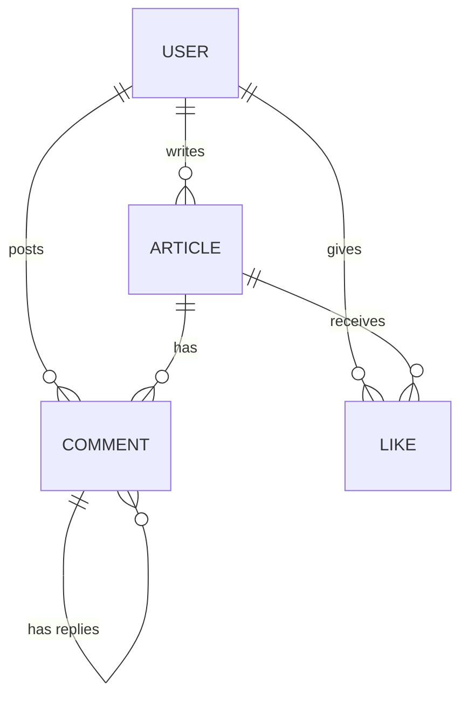

# 设计文档

## 概述

本系统是一个前后端分离的博客系统。后端基于 Spring Boot 2.7.x（Java 8），提供 RESTful API；前端基于 Nuxt 3（Vue 3 SSR 框架）+ JavaScript，采用服务端渲染模式，通过 HTTP 调用后端接口；数据库使用 MySQL 8。

核心功能包括：用户注册登录（JWT 鉴权）、文章 CRUD、评论（含楼中楼嵌套）、点赞（切换式）、音乐播放器。采用 SSR 模式可提升首屏加载速度和 SEO 友好性，对博客类内容站点尤为重要。

### 设计边界

- 本系统为单体应用，不涉及微服务拆分
- 不涉及文件上传（音乐文件通过后台接口录入元信息，文件本身由静态资源服务提供）
- 不涉及富文本编辑器，文章正文以纯文本/Markdown 字符串存储
- 不涉及用户角色权限体系（仅区分已登录/未登录，管理员功能仅限音乐上传接口）
- 不涉及搜索引擎、缓存层、消息队列等中间件（但架构预留扩展点，详见"后期扩展预留"章节）
- 前端采用 Nuxt 3 SSR 模式，文章列表和详情页使用服务端渲染以优化 SEO 和首屏性能；用户交互类页面（登录、注册）使用客户端渲染

## 架构

### 整体架构

```
┌──────────────────┐                    ┌──────────────────┐     JDBC     ┌─────────┐
│   Browser/Client │                    │  Spring Boot API  │ ◄──────────► │  MySQL  │
│                  │                    │    (Backend)      │              │   8.x   │
└────────┬─────────┘                    └────────▲─────────┘              └─────────┘
         │                                       │
         │  HTML (SSR) / JSON (CSR)              │ HTTP/JSON
         │                                       │
┌────────▼─────────┐                             │
│   Nuxt 3 Server  │ ────────────────────────────┘
│  (SSR + API Proxy)│
└──────────────────┘
```

- Nuxt 3 Server 负责服务端渲染页面（文章列表、文章详情等 SEO 关键页面）
- 客户端交互（登录、注册、点赞、评论提交）在浏览器端通过 Hydration 后执行
- Nuxt 3 通过 `useFetch` / `useAsyncData` 在服务端请求 Spring Boot API，渲染完成后将 HTML 发送给浏览器

### 后端分层

```
Controller → Service → Repository → MySQL
     ↑
  JWT Filter (Spring Security)
```

- Controller 层：接收 HTTP 请求，参数校验，调用 Service
- Service 层：业务逻辑
- Repository 层：Spring Data JPA，数据访问
- Security 层：JWT 过滤器，拦截需要认证的请求

### 前端结构（Nuxt 3）

```
├── pages/              # 页面路由（Nuxt 基于文件系统自动生成路由）
│   ├── index.vue       # 首页（SSR）
│   ├── articles/
│   │   └── [id].vue    # 文章详情页（SSR）
│   ├── login.vue       # 登录页（CSR）
│   └── register.vue    # 注册页（CSR）
├── components/         # 通用组件（MusicPlayer、CommentList 等）
├── composables/        # 组合式函数（useAuth、useArticle 等）
├── server/             # Nuxt Server 端逻辑（API 代理等，可选）
├── plugins/            # 插件（如 auth 初始化）
├── middleware/          # 路由中间件（认证守卫）
├── stores/             # Pinia 状态管理（用户登录状态、Token）
└── utils/              # 工具函数
```

#### SSR 渲染策略

| 页面 | 渲染模式 | 原因 |
|------|---------|------|
| 首页（文章列表） | SSR | SEO 关键页面，需要搜索引擎抓取 |
| 文章详情页 | SSR | SEO 关键页面，文章内容需被索引 |
| 登录页 | CSR | 纯交互页面，无 SEO 需求 |
| 注册页 | CSR | 纯交互页面，无 SEO 需求 |

通过 Nuxt 3 的 `routeRules` 配置不同页面的渲染模式：

```javascript
// nuxt.config.ts
export default defineNuxtConfig({
  routeRules: {
    '/': { ssr: true },
    '/articles/**': { ssr: true },
    '/login': { ssr: false },
    '/register': { ssr: false }
  }
})
```

## 组件与接口

### 后端 REST API

#### 认证模块

| 方法 | 路径 | 说明 | 认证 |
|------|------|------|------|
| POST | `/api/auth/register` | 用户注册 | 否 |
| POST | `/api/auth/login` | 用户登录 | 否 |

#### 文章模块

| 方法 | 路径 | 说明 | 认证 |
|------|------|------|------|
| GET | `/api/articles?page=&size=` | 分页获取文章列表 | 否 |
| GET | `/api/articles/{id}` | 获取文章详情 | 否（登录用户额外返回点赞状态） |
| POST | `/api/articles` | 创建文章 | 是 |
| PUT | `/api/articles/{id}` | 修改文章 | 是（仅作者） |
| DELETE | `/api/articles/{id}` | 删除文章 | 是（仅作者） |

#### 评论模块

| 方法 | 路径 | 说明 | 认证 |
|------|------|------|------|
| GET | `/api/articles/{articleId}/comments` | 获取文章评论列表（含嵌套） | 否 |
| POST | `/api/articles/{articleId}/comments` | 创建评论 | 是 |
| DELETE | `/api/comments/{id}` | 删除评论 | 是（仅评论者） |

#### 点赞模块

| 方法 | 路径 | 说明 | 认证 |
|------|------|------|------|
| POST | `/api/articles/{articleId}/like` | 点赞/取消点赞（切换） | 是 |

#### 音乐模块

| 方法 | 路径 | 说明 | 认证 |
|------|------|------|------|
| GET | `/api/music` | 获取音乐列表 | 否 |
| POST | `/api/music` | 上传音乐信息（管理员） | 是 |

### 后端核心组件


```
AuthController        → AuthService        → UserRepository
ArticleController     → ArticleService     → ArticleRepository
CommentController     → CommentService     → CommentRepository
LikeController        → LikeService        → LikeRepository
MusicController       → MusicService       → MusicRepository
JwtAuthenticationFilter (Spring Security Filter)
JwtUtil (Token 生成与验证工具类)
```

### 关键接口定义

#### AuthService

```java
public interface AuthService {
    UserDTO register(RegisterRequest request);    // 注册
    LoginResponse login(LoginRequest request);    // 登录，返回 JWT Token
}
```

#### ArticleService

```java
public interface ArticleService {
    ArticleDTO create(Long userId, CreateArticleRequest request);
    ArticleDTO update(Long userId, Long articleId, UpdateArticleRequest request);
    void delete(Long userId, Long articleId);
    Page<ArticleSummaryDTO> list(int page, int size);
    ArticleDetailDTO getDetail(Long articleId, Long currentUserId);
}
```

#### CommentService

```java
public interface CommentService {
    CommentDTO create(Long userId, Long articleId, CreateCommentRequest request);
    void delete(Long userId, Long commentId);
    List<CommentTreeDTO> listByArticle(Long articleId);
}
```

#### LikeService

```java
public interface LikeService {
    boolean toggleLike(Long userId, Long articleId);  // 返回当前点赞状态
    long countByArticle(Long articleId);
    boolean isLikedByUser(Long userId, Long articleId);
}
```

#### MusicService

```java
public interface MusicService {
    List<MusicDTO> list();
    MusicDTO create(CreateMusicRequest request);
}
```

### 前端核心组件

| 组件 | 职责 |
|------|------|
| `pages/index.vue` | 首页，SSR 渲染分页文章列表 |
| `pages/articles/[id].vue` | 文章详情页，SSR 渲染文章、评论、点赞 |
| `pages/login.vue` | 登录页（CSR） |
| `pages/register.vue` | 注册页（CSR） |
| `MusicPlayer` | 音乐播放器组件，全局悬浮 |
| `CommentList` | 评论列表组件，支持嵌套展示 |
| `CommentForm` | 评论输入组件 |

## 数据模型

### ER 关系图



### 数据库表结构

#### user 表

| 字段 | 类型 | 约束 | 说明 |
|------|------|------|------|
| id | BIGINT | PK, AUTO_INCREMENT | 用户 ID |
| username | VARCHAR(50) | UNIQUE, NOT NULL | 用户名 |
| password | VARCHAR(255) | NOT NULL | 加密后的密码 |
| email | VARCHAR(100) | UNIQUE, NOT NULL | 邮箱 |
| created_at | DATETIME | NOT NULL | 创建时间 |

#### article 表

| 字段 | 类型 | 约束 | 说明 |
|------|------|------|------|
| id | BIGINT | PK, AUTO_INCREMENT | 文章 ID |
| title | VARCHAR(200) | NOT NULL | 标题 |
| content | TEXT | NOT NULL | 正文 |
| author_id | BIGINT | FK → user.id, NOT NULL | 作者 ID |
| created_at | DATETIME | NOT NULL | 创建时间 |
| updated_at | DATETIME | NOT NULL | 更新时间 |

#### comment 表

| 字段 | 类型 | 约束 | 说明 |
|------|------|------|------|
| id | BIGINT | PK, AUTO_INCREMENT | 评论 ID |
| content | VARCHAR(1000) | NOT NULL | 评论内容 |
| user_id | BIGINT | FK → user.id, NOT NULL | 评论者 ID |
| article_id | BIGINT | FK → article.id, NOT NULL | 所属文章 ID |
| parent_id | BIGINT | FK → comment.id, NULLABLE | 父评论 ID（NULL 表示顶级评论） |
| created_at | DATETIME | NOT NULL | 创建时间 |

#### article_like 表

| 字段 | 类型 | 约束 | 说明 |
|------|------|------|------|
| id | BIGINT | PK, AUTO_INCREMENT | 点赞 ID |
| user_id | BIGINT | FK → user.id, NOT NULL | 点赞用户 ID |
| article_id | BIGINT | FK → article.id, NOT NULL | 被点赞文章 ID |
| created_at | DATETIME | NOT NULL | 创建时间 |
| | | UNIQUE(user_id, article_id) | 唯一约束，防止重复点赞 |

#### music 表

| 字段 | 类型 | 约束 | 说明 |
|------|------|------|------|
| id | BIGINT | PK, AUTO_INCREMENT | 音乐 ID |
| name | VARCHAR(200) | NOT NULL | 曲目名称 |
| file_path | VARCHAR(500) | NOT NULL | 文件路径/URL |
| created_at | DATETIME | NOT NULL | 创建时间 |

### JPA Entity 映射说明

- 所有实体使用 `@Entity` + `@Table` 注解
- 主键使用 `@Id` + `@GeneratedValue(strategy = GenerationType.IDENTITY)`
- 关联关系使用 `@ManyToOne`（懒加载）和 `@OneToMany`
- comment 表的 `parent_id` 使用自关联 `@ManyToOne` 实现楼中楼
- article_like 表的唯一约束使用 `@Table(uniqueConstraints = ...)` 实现
- 密码加密使用 Spring Security 的 `BCryptPasswordEncoder`
- JWT 使用 `io.jsonwebtoken:jjwt` 库

## 后期扩展预留

本章节列出当前版本不实现但架构上预留扩展能力的方向，确保后续迭代时无需大规模重构。

### 缓存层

- 当前直接查询数据库，后期可在 Service 层引入 Redis 缓存
- 预留扩展点：
  - 文章列表和详情的热点数据缓存（Service 层方法粒度，便于加 `@Cacheable` 注解）
  - 点赞计数缓存（LikeService 的 `countByArticle` 方法可直接加缓存）
  - 用户 Session / Token 黑名单（JwtUtil 可扩展为查询 Redis 黑名单）
- 架构建议：Service 接口不变，仅在实现层添加缓存逻辑，对 Controller 透明

### 搜索功能

- 当前文章查询仅支持分页列表，后期可引入全文搜索
- 预留扩展点：
  - ArticleService 可新增 `search(String keyword, int page, int size)` 方法
  - 后端 API 预留 `GET /api/articles/search?q=&page=&size=` 路径
  - 后期可接入 Elasticsearch，通过数据同步（binlog 或应用层双写）建立索引
- 数据模型：article 表的 `title` 和 `content` 字段已为 TEXT 类型，可直接建立全文索引

### 消息队列

- 当前所有操作同步执行，后期可引入消息队列解耦异步任务
- 预留扩展点：
  - 评论/点赞通知：当前不实现通知功能，后期可通过 MQ 异步发送通知
  - 文章发布事件：可用于触发搜索索引更新、缓存刷新等
  - Service 层的关键操作方法保持单一职责，便于后期抽取事件发布逻辑
- 架构建议：可引入 Spring Event 作为过渡方案，后期替换为 RabbitMQ / Kafka

### 角色权限体系

- 当前仅区分已登录/未登录，管理员功能硬编码
- 预留扩展点：
  - user 表可后期新增 `role` 字段（如 `ROLE_USER`、`ROLE_ADMIN`、`ROLE_EDITOR`）
  - Spring Security 已集成，后期可通过 `@PreAuthorize` 注解实现方法级权限控制
  - JWT Token 中可扩展携带角色信息（当前仅含 userId 和 username，结构可扩展）
- 架构建议：当前 JwtUtil 和 Security Filter 的设计已兼容角色扩展，无需重构核心鉴权流程

### 其他可能的扩展方向

| 扩展方向 | 预留设计 | 说明 |
|---------|---------|------|
| 文章标签/分类 | article 表可新增关联表 `article_tag` | 多对多关系，不影响现有表结构 |
| 文件上传（图片/附件） | 独立的 FileService 接口 | 可对接 OSS 或本地存储 |
| 国际化（i18n） | Nuxt 3 原生支持 `@nuxtjs/i18n` 模块 | 前端可按需引入 |
| API 版本管理 | 当前 API 路径为 `/api/...` | 后期可改为 `/api/v1/...`，通过路径区分版本 |
| 评论审核 | comment 表可新增 `status` 字段 | 默认 `APPROVED`，后期支持 `PENDING`/`REJECTED` |


## 正确性属性

*属性（Property）是指在系统所有有效执行中都应成立的特征或行为——本质上是对系统行为的形式化陈述。属性是人类可读的规格说明与机器可验证的正确性保证之间的桥梁。*

### 属性 1：密码安全性

*对于任意*有效的注册请求，注册成功后：(a) API 响应中不应包含密码字段；(b) 数据库中存储的密码不应等于原始密码明文，且应为有效的 BCrypt 哈希值。

**验证需求：1.5, 1.6**

### 属性 2：JWT Token 往返一致性

*对于任意*用户 ID 和用户名，使用 JwtUtil 编码生成 Token 后再解码，应能还原出相同的用户 ID 和用户名。

**验证需求：2.4**

### 属性 3：文章详情完整性

*对于任意*已创建的文章，通过详情接口查询应返回包含标题、正文、作者信息、创建时间、更新时间和点赞数的完整信息，且作者 ID 与创建者一致。

**验证需求：3.4, 3.9**

### 属性 4：文章列表排序不变量

*对于任意*文章列表查询结果，返回的文章应按创建时间严格倒序排列，即对于结果中任意相邻的两篇文章，前一篇的创建时间不早于后一篇。

**验证需求：3.8**

### 属性 5：评论树形结构与排序

*对于任意*文章的评论列表，顶级评论应按创建时间正序排列，每条顶级评论下的嵌套评论也应按创建时间正序排列，且嵌套评论的 parent_id 应指向其所属的顶级评论。

**验证需求：4.4, 4.5**

### 属性 6：点赞切换与唯一性

*对于任意*用户和文章，执行两次连续点赞操作后，该用户对该文章的点赞状态应回到初始状态（未点赞），且数据库中同一用户对同一文章最多存在一条 Like 记录。

**验证需求：5.2, 5.3**

### 属性 7：点赞计数一致性

*对于任意*文章，API 返回的点赞数应等于数据库中该文章的 Like 记录总数。

**验证需求：5.4**

### 属性 8：播放列表导航

*对于任意*非空播放列表和当前播放索引，next 操作应将索引移动到 `(current + 1) % length`，prev 操作应将索引移动到 `(current - 1 + length) % length`。当最后一首播放结束时，应自动回到第一首。

**验证需求：6.4, 6.5, 6.6, 6.7**

### 属性 9：Article 创建-查询往返

*对于任意*有效的 Article 对象（包含标题和正文），通过 API 创建后再通过 API 查询，返回的标题和正文应与创建时提交的一致。

**验证需求：8.8**

### 属性 10：Comment 创建-查询往返

*对于任意*有效的 Comment 对象（包含评论内容和所属文章），通过 API 创建后再通过 API 查询，返回的评论内容、评论者和所属文章应与创建时一致。

**验证需求：8.9**

## 错误处理

### 后端错误处理策略

使用 Spring Boot 的 `@RestControllerAdvice` 全局异常处理器，统一错误响应格式：

```json
{
  "code": 400,
  "message": "错误描述",
  "timestamp": "2024-01-01T00:00:00"
}
```

| 异常类型 | HTTP 状态码 | 场景 |
|---------|------------|------|
| `IllegalArgumentException` | 400 | 参数校验失败（空标题、空内容、短密码等） |
| `DuplicateKeyException` | 409 | 用户名/邮箱重复 |
| `AuthenticationException` | 401 | 登录失败、Token 无效/过期 |
| `AccessDeniedException` | 403 | 操作非自己的文章/评论 |
| `EntityNotFoundException` | 404 | 文章/评论不存在 |
| `Exception` | 500 | 未预期的服务器错误 |

### 前端错误处理策略

- 使用 Nuxt 3 的 `useError` 和 `showError` 处理全局错误
- 通过 `useFetch` / `$fetch` 的 `onResponseError` 拦截 API 错误
- 401 错误：清除 Token，使用 `navigateTo('/login')` 跳转登录页
- 403 错误：提示无权限
- 404 错误：使用 Nuxt 3 的 `error.vue` 页面展示错误
- SSR 阶段的错误通过 Nuxt 3 的错误边界处理，避免整页崩溃
- 其他错误：Toast 提示错误信息

## 测试策略

### 后端测试

#### 单元测试（JUnit 5 + Mockito）

- 每个 Service 类的业务逻辑方法
- JwtUtil 的 Token 生成与解析
- 输入校验逻辑
- 权限检查逻辑

#### 集成测试（Spring Boot Test + H2 内存数据库）

- 认证流程：注册 → 登录 → 获取 Token → 访问认证接口
- 文章 CRUD：创建 → 查询 → 修改 → 删除 → 验证级联删除
- 评论流程：创建评论 → 创建嵌套评论 → 查询树形结构 → 删除级联
- 点赞流程：点赞 → 验证状态 → 再次点赞取消 → 验证计数

#### 属性测试（jqwik）

使用 jqwik 库进行属性测试，每个属性测试最少运行 100 次迭代。

- **属性 1**：密码安全性 — 生成随机密码，验证 BCrypt 加密后不等于原文且可验证
- **属性 2**：JWT Token 往返 — 生成随机用户 ID 和用户名，编码后解码验证一致
- **属性 3**：文章详情完整性 — 生成随机文章，创建后查询验证字段完整
- **属性 4**：文章列表排序 — 创建多篇文章，查询列表验证倒序
- **属性 5**：评论树形结构 — 创建随机评论树，查询验证结构和排序
- **属性 6**：点赞切换 — 随机用户对随机文章执行偶数次点赞，验证回到初始状态
- **属性 7**：点赞计数 — 随机数量用户点赞，验证计数一致
- **属性 8**：播放列表导航 — 生成随机播放列表和索引，验证 next/prev 计算正确
- **属性 9**：Article 往返 — 生成随机文章，创建后查询验证一致
- **属性 10**：Comment 往返 — 生成随机评论，创建后查询验证一致

每个属性测试需标注注释：`Feature: blog-system, Property {number}: {property_text}`

### 前端测试（Vitest + @nuxt/test-utils + Vue Test Utils）

#### 组件单元测试

- MusicPlayer：播放、暂停、切换曲目、循环播放
- CommentList：评论树形渲染
- 登录/注册页面：表单校验、提交逻辑

#### SSR 测试

- 使用 `@nuxt/test-utils` 验证文章列表页和详情页的 SSR 渲染输出
- 验证 SSR 页面包含正确的 meta 标签（SEO）
- 验证 Hydration 后客户端交互正常

#### 属性测试（fast-check）

- **属性 8**：播放列表导航逻辑（纯函数，在前端测试）

### 测试执行原则

- 每完成一个功能模块，立即编写并运行对应测试
- 测试通过后再进入下一个功能模块
- 集成测试使用 H2 内存数据库，不依赖外部 MySQL
- 属性测试每个属性最少 100 次迭代
